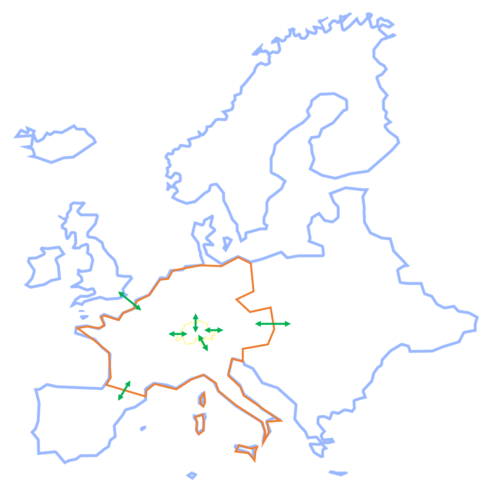

# sweet-sure-2050-switzerland  [](https://doi.org/10.5281/zenodo.6653948)


Description
-----------

This is a repository containing a data package that implements the projections of the 
TIMES model for Switzerland (STEM) within the life-cycle assessment (LCA) database ecoinvent.
Projections are implemented for the scenarios **SPS1** and **SPS4**, developed within SFOE's SWEET-SURE program.

This data package is meant to be used in `premise` in addition to a global IAM scenario, to provide 
refined projections at the country level. `premise` can export the result as a data package for `pathways`,
which is then used to compute the system-wide impacts of the energy scenario produced by STEM.

This data package contains all the files necessary for `premise` to implement
this scenario and create market-specific composition for electricity (including imports from
neighboring countries), liquid and gaseous fuels (including hydrogen) and models their supply and use.

Publication
-----------

This data package is used to produce results for the following publication:

Switzerland's net zero objective: quantifying impacts beyond borders 
Alvaro Jose Hahn Menacho, Romain Sacchi, Christian Bauer, Evangelos Panos and Peter Burgherr
*In review.*


Ecoinvent database compatibility
--------------------------------

ecoinvent 3.10 cut-off


License
-------

This scenario is licensed under the Creative Commons Attribution 4.0 International Public License (CC BY 4.0).
See the LICENSE file for more details.


What does this do?
------------------



This external scenario creates markets for Switzerland listed below, according
to the projections from the Energy Perspectives 2050+ (yellow boundaries in map above).

Markets
*******

* market for biogas, domestic (SPS)
* market for biomass, for power generation (SPS)
* market for diesel (SPS)
* market for district heating (SPS)
* market for electricity, high voltage (SPS)
* market for electricity, low voltage (SPS)
* market for electricity, medium voltage (SPS)
* market for energy carriers for buses (SPS)
* market for energy carriers for cars (SPS)
* market for energy carriers for coaches (SPS)
* market for energy carriers for heavy duty trucks (SPS)
* market for energy carriers for light duty trucks (SPS)
* market for energy carriers for motorcycles (SPS)
* market for energy carriers for other transport (SPS)
* market for hydrogen (SPS)
* market for methane (SPS)
* market for petrol (SPS)
* market for process heat and space heating in industry (SPS)
* market for process heat in industry (SPS)
* market for space and water heating in residential (SPS)
* market for space heating in industry (SPS)
* market for space heating in residential (SPS)
* market for space heating in services (SPS)
* market for water heating in residential (SPS)


These markets are relinked to activities that consume final energy in Switzerland.

Additionally, the Swiss markets rely to a varying extent on imports from
neighboring countries, which is provided by the regional IAM market.


How are technologies mapped?
---------------------------

See the mapping file: configuration_file/config.yaml.


How to use it?
--------------

The following script results in teh generation of four LCA databases for the years 2020, 2030, 2040 and 2050,
with STEM's SPS1 scenario combined with REMIND's SSP2-NPi scenario.

Other scenarios can be implemented by changing the `scenarios` list.
List of available scenarios can be found in the `datapackage.json` file.

```python

    from premise import *
    import bw2data
    from datapackage import Package
    bw2data.projects.set_current("some brightway project")
    
    
    sps = Package("../datapackage.json")
    scenarios = [
        {"model": "remind", "pathway": "SSP2-NPi", "year": 2020, "external scenarios": [{"scenario": "SPS1", "data": sps}]},
        {"model": "remind", "pathway": "SSP2-NPi", "year": 2030, "external scenarios": [{"scenario": "SPS1", "data": sps}]},
        {"model": "remind", "pathway": "SSP2-NPi", "year": 2040, "external scenarios": [{"scenario": "SPS1", "data": sps}]},
        {"model": "remind", "pathway": "SSP2-NPi", "year": 2050, "external scenarios": [{"scenario": "SPS1", "data": sps}]},
    ]
    
    ndb = NewDatabase(
            scenarios=scenarios,
            source_db="ecoinvent-3.10-cutoff", # <-- name of the database in the BW2 project. Must be a string.
            source_version="3.10", # <-- version of ecoinvent. Can be "3.5", "3.6", "3.7" or "3.8". Must be a string.
            key="xxxx", # <-- ask the key to run premise from the developers
            use_absolute_efficiency=True,
            biosphere_name="ecoinvent-3.10-biosphere"
            
    )
    
    ndb.update()
    
    ndb.write_db_to_brightway()


```

