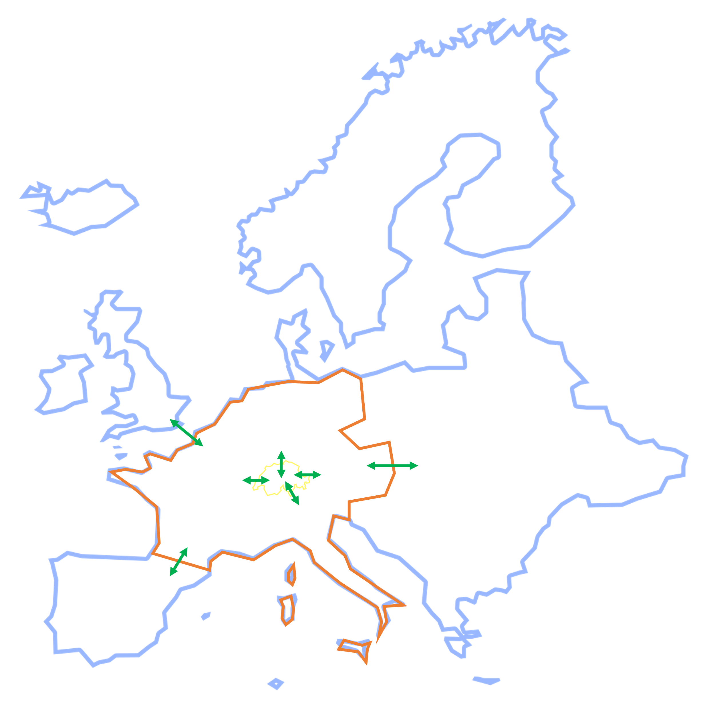

# sweet-sure-2050-switzerland 


Description
-----------

This is a repository containing a data package that implements the projections of the 
TIMES model for Switzerland (STEM) within the life-cycle assessment (LCA) database ecoinvent.
Projections are implemented for the scenarios **SPS1** and **SPS4**, developed within SFOE's SWEET-SURE program.

This data package is meant to be used in `premise` in addition to a global IAM scenario, to provide 
refined projections at the country level. `premise` can export the result as a data package for `pathways`,
which is then be used to compute the system-wide impacts of the energy scenario produced by STEM.

This data package contains all the files necessary for `premise` to implement
this scenario and create market-specific composition for electricity (including imports from
neighboring countries), liquid and gaseous fuels (including hydrogen) and models their supply and use.

Publication
-----------

This data package is used to produce results for the following publication:

**The global environmental footprint of Switzerland’s net-zero energy system uncovers impacts abroad**  
Alvaro Jose Hahn Menacho, Romain Sacchi, Christian Bauer, Christian Moretti, Evangelos Panos, Russell McKenna and Peter Burgherr.  
*Communications Earth & Environment 6 (1), 266. doi: https://doi.org/10.1038/s43247-025-02220-5*

**The material-energy nexus in net-zero transition scenarios: exploring environmental trade-offs and uncertainties**  
Alvaro Jose Hahn Menacho, Romain Sacchi, Christian Bauer, Evangelos Panos, Russell McKenna and Peter Burgherr.  
*Resources, Conservation and Recycling 218, 108251. doi: https://doi.org/10.1016/j.resconrec.2025.108251*


Ecoinvent database compatibility
--------------------------------

This branch (`ei312`) targets **ecoinvent 3.12 cut-off** with `premise>=2.5.1`.
The previous implementation remains on `ei311`.

The `ecoinvent.version` field in `datapackage.json` stays at `3.10`: it describes
the source version of the additional inventory workbook. Premise uses this field
to migrate its exchanges to the target `source_version="3.12"`, including supplier
splits and renamed products. Changing that field to `3.12` would skip migration.

See [premise compatibility](https://premise.readthedocs.io/en/latest/reference/compatibility.html).
The workbook resource is declared as XLSX.

The wood-chip alias and market replacement use the 3.12 name, `wood chips, green,
measured as dry mass`. The workbook's Swiss multi-Si photovoltaic supplier name
is corrected to match ecoinvent. Its formulas, cached values and other contents
are preserved.

The BECCS alias uses the current premise BIGCC inventory with **post-combustion**
capture, a 200 km pipeline and 1,000 m storage. The previous alias requested a
pre-combustion dataset that is absent from the current bundled inventory. This
technology substitution can change BECCS results and should be considered when
comparing with results from `ei311`.


License
-------

This scenario is licensed under the Creative Commons Attribution 4.0 International Public License (CC BY 4.0).
See the LICENSE file for more details.


What does this do?
------------------



This external scenario creates markets for Switzerland listed below, according
to the scenarios SPS1 and SPS4 generated by the Swiss TIMES energy model STEM 
(yellow boundaries in map above).

Markets
*******

* market for biogas, domestic (SPS)
* market for biomass, for power generation (SPS)
* market for diesel (SPS)
* market for district heating (SPS)
* market for electricity, high voltage (SPS)
* market for electricity, low voltage (SPS)
* market for electricity, medium voltage (SPS)
* market for energy carriers for buses (SPS)
* market for energy carriers for cars (SPS)
* market for energy carriers for coaches (SPS)
* market for energy carriers for heavy duty trucks (SPS)
* market for energy carriers for light duty trucks (SPS)
* market for energy carriers for motorcycles (SPS)
* market for energy carriers for other transport (SPS)
* market for hydrogen (SPS)
* market for methane (SPS)
* market for petrol (SPS)
* market for process heat and space heating in industry (SPS)
* market for process heat in industry (SPS)
* market for space and water heating in residential (SPS)
* market for space heating in industry (SPS)
* market for space heating in residential (SPS)
* market for space heating in services (SPS)
* market for water heating in residential (SPS)


These markets are relinked to activities that consume final energy in Switzerland.

Additionally, the Swiss markets rely to a varying extent on imports from
neighboring countries, which is provided by the regional IAM market.


How are technologies mapped?
---------------------------

See the mapping file: configuration_file/config.yaml.


How to use it?
--------------

The following script generates four LCA databases for the years 2020, 2030, 2040 and 2050,
with STEM's SPS1 scenario combined with REMIND's SSP2-NPi scenario.

Run the examples from the repository root with `PREMISE_KEY` set.
Other scenarios can be implemented by changing the `scenarios` list.
List of available scenarios can be found in the `datapackage.json` file.

```python

import os
from premise import NewDatabase, PathwaysDataPackage
import bw2data
from datapackage import Package
bw2data.projects.set_current("ecoinvent-3.12-cutoff")


sps = Package("datapackage.json")
scenarios = [
    {"model": "remind", "pathway": "SSP2-NPi", "year": 2020, "external scenarios": [{"scenario": "SPS1_bas0", "data": sps}]},
    {"model": "remind", "pathway": "SSP2-NPi", "year": 2030, "external scenarios": [{"scenario": "SPS1_bas0", "data": sps}]},
    {"model": "remind", "pathway": "SSP2-NPi", "year": 2040, "external scenarios": [{"scenario": "SPS1_bas0", "data": sps}]},
    {"model": "remind", "pathway": "SSP2-NPi", "year": 2050, "external scenarios": [{"scenario": "SPS1_bas0", "data": sps}]},
]

ndb = NewDatabase(
        scenarios=scenarios,
        source_db="ecoinvent-3.12-cutoff", # <-- name of the database in the BW2 project. Must be a string.
        source_version="3.12", # <-- version of ecoinvent. Must be a string.
        key=os.environ["PREMISE_KEY"], # IAM decryption key
        use_absolute_efficiency=True,
        biosphere_name="biosphere"

)

ndb.update()

ndb.write_db_to_brightway()


```

To produce a data package for `pathways`, use the following script instead:

```python

import os
from premise import NewDatabase, PathwaysDataPackage
import bw2data
from datapackage import Package
bw2data.projects.set_current("ecoinvent-3.12-cutoff")


sps = Package("datapackage.json")
scenarios=[
    {"model": "remind", "pathway": "SSP2-NPi", "external scenarios": [{"scenario": "SPS4_bas0", "data": sps}]},
    {"model": "remind", "pathway": "SSP2-PkBudg1000", "external scenarios": [{"scenario": "SPS4_bas0", "data": sps}]},
    {"model": "remind", "pathway": "SSP2-PkBudg650", "external scenarios": [{"scenario": "SPS4_bas0", "data": sps}]},
    {"model": "remind", "pathway": "SSP2-NPi", "external scenarios": [{"scenario": "SPS1_bas0", "data": sps}]},
    {"model": "remind", "pathway": "SSP2-PkBudg1000", "external scenarios": [{"scenario": "SPS1_bas0", "data": sps}]},
    {"model": "remind", "pathway": "SSP2-PkBudg650", "external scenarios": [{"scenario": "SPS1_bas0", "data": sps}]},
]

for scenario in scenarios:
    name=f"{scenario['model']}-{scenario['pathway']}-stem-{scenario['external scenarios'][0]['scenario']}"
    print(name)
    ndb = PathwaysDataPackage(
        scenarios=[scenario,],
        years=[2020, 2025, 2030, 2035, 2040, 2045, 2050],
        source_db="ecoinvent-3.12-cutoff",
        source_version="3.12",
        key=os.environ["PREMISE_KEY"],
        use_absolute_efficiency=True,
        biosphere_name="biosphere"
    )

    ndb.create_datapackage(
        name=name,
        contributors=[
            {"name": "some name",
            "email": "some email adress",}
        ],
    )

```

This will produce six different data packages, one for each combination of REMIND's SSP2-NPi and SSP2-PkBudg1000
and SPS1 and SPS4 scenarios. These data packages can then be read by `pathways` to compute the system-wide impacts of 
the energy scenario produced by STEM.


Validation
----------

Run from the repository root with the Brightway project and encrypted IAM key available:

```bash
python -m pytest tests -q
export PREMISE_KEY="<your IAM decryption key>"
python dev/validate_ei312.py --scenario SPS1_bas0 --year 2050
```

The validator builds the external scenario on the 3.12 background and checks unique
technosphere suppliers, biosphere flow codes, finite amounts and expected Swiss
markets without writing a Brightway database. It saves an aggregate JSON report with
resource checksums; no proprietary background inventories are exported.
Use `--project`, `--source-db`, and `--biosphere` for different local database names.
The default biosphere database in the validation project is `biosphere`.

The `SPS1_bas0` / 2050 external-sector build passed with 30,019 datasets and
27 Swiss SPS markets; all supplier and biosphere links resolved. The five tests
also passed. See [validation details and limitations](dev/ei312-validation.md)
and the [validation report](dev/ei312-validation.json).

Trailing whitespace in rail and coach variable names was removed from the scenario CSV;
all numerical scenario values are preserved. The formatter now trims variable names
to prevent the mismatch recurring.
